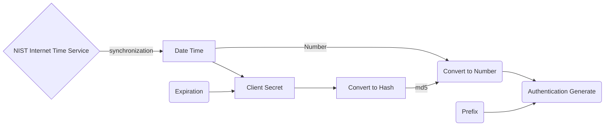

# NodeAuth2
 Network based one time password genarete

```mermaid
graph LR
B[Date Time]  --> A[Client Secret]
B -- Number --> F(Convert to Number)
W(Expiration) --> A
A --> G[Convert to Hash]
D{NIST Internet Time Service} -- synchronization --> B
G -- md5 --> F 
F --> E(Authentication Generate)
H(Prefix) --> E
```
