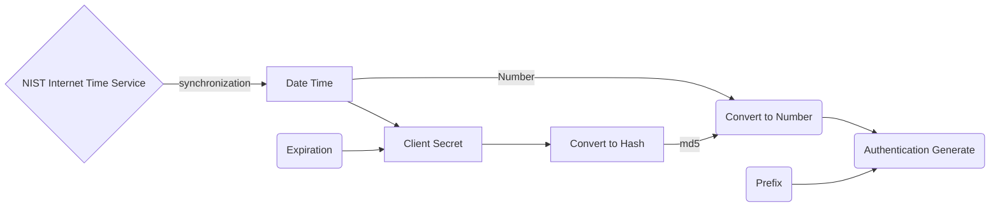

# NodeAuth2
[![npm-image]][npm-url]

 Network based one time password genarete

   [npm-image]: https://img.shields.io/npm/v/mira-db.svg?style=flat
   [npm-url]: https://npmjs.org/package/mira-db   [flow-url]: https://npmjs.org/package/mira-db